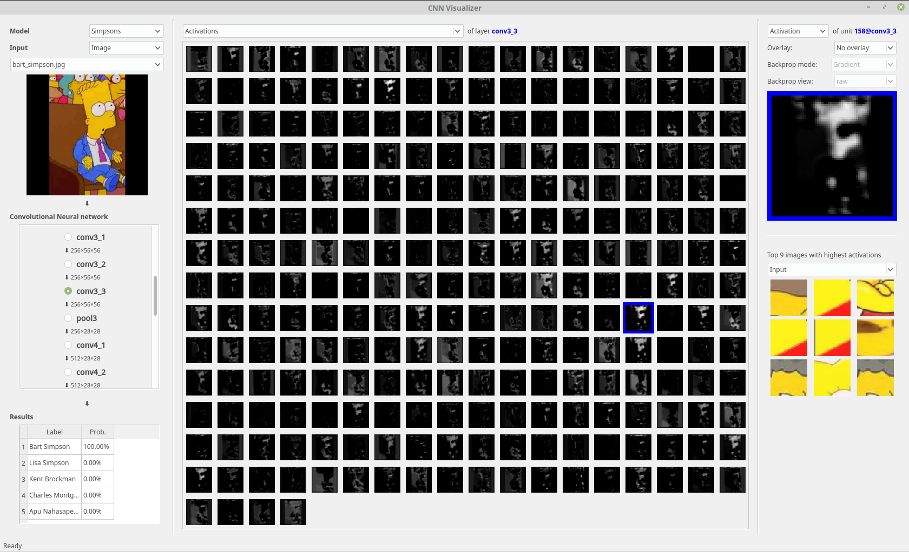

# CNN Visualizer

This is a simple convolutional neural network visualizer using PyQt and Caffe.

The work is based on [Deep Visualization Toolbox](https://github.com/yosinski/deep-visualization-toolbox).
The toolbox and methods are described casually [here](http://yosinski.com/deepvis) and more formally in this paper:
 * Jason Yosinski, Jeff Clune, Anh Nguyen, Thomas Fuchs, and Hod Lipson. [Understanding neural networks through deep visualization](http://arxiv.org/abs/1506.06579). Presented at the Deep Learning Workshop, International Conference on Machine Learning (ICML), 2015.

The code of [the improved version](https://github.com/arikpoz/deep-visualization-toolbox) by Arik Poznanski were also used. 

## Features
Main features of the Deep Visualization Toolbox that are implemented in the CNN Visualizer:
 * Activation of each neuron
 * Backprop/Deconvolution/Guided backprop 
 * Images that cause high activation (These images are pre-computed by the scripts in _./find_maxes/_)
 
Missing feature:
 * Synthetic images that cause high activation
 
The GUI looks like this:

 
## Supported network architectures
In the very beginning, this tool was intended for VGG16. Support for other VGG16-like CNNs were added later.

Non-sequential networks are not supported.    
 
## Setting up
The visualizer runs with python 2 on linux.
### 1. Get PyQt running.
You may need to install [Qt5](https://www.qt.io/download), [SIP](https://www.riverbankcomputing.com/software/sip/download) and [PyQt5](https://www.riverbankcomputing.com/software/pyqt/download5).

### 2. Compile the modified caffe by Arik Poznanski
Get the code by from [the repository](https://github.com/arikpoz/caffe/tree/7fec25bad4405fb97b9a48d7307d8a8bb8bacae9)

Configure _Makefile.config.example_ accordingly and rename it to _Makefile.config_.

Compile by running:
```
make all pycaffe 
```

### 3. Download and configure the CNN visualizer
Change the general settings in _main_settings.yaml_. 

Use _model_setting_template.yaml_ as template to create settings file for the new model and then register this file in _main_settings.yaml_ 

Compute the top images (optional):
```
python find_maxes/find_max_act.py --model dummy_model_name
python find_maxes/crop_max_patches.py --model dummy_model_name
```

Run the tool by:
```
python CNN_Vis_Demo.py
```


